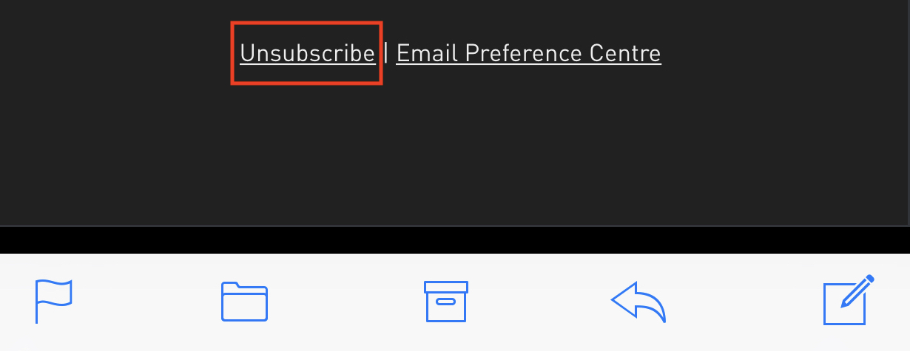

Distractions and interruptions take us out of a state of flow. Distractions reduce our effectiveness as programmers.
This is because each distraction makes us perform a context switch. A context switch takes us out of "the zone". 
The zone, also known as "flow state" is a particularly important state of mind to be in when writing code: It is when 
we move the fastest. 

## Notifications
Every notification that we notice - hear, see, feel buzz takes us out of the zone. Each little ding, flash or buzz 
receives our immediate attention. I have made a lot of silly mistakes this way such as missing one other place that a 
variable needed renamed.

What can we do?

### Unsubscribe from spam emails

I’ll admit it, I was one of those people who had a huge number in a red circle on my iPhone mail app. 
Almost none of the emails were from people I knew, all 95% of them were those spam emails and newsletters 
from websites that I had signed up to and who (before GDPR) had shared my email address with a third party. 

At the bottom of each of these emails, there is an unsubscribe link. Click this and in my experience, most of the
links unsubscribe you in one click. With each of emails, you unsubscribe to, go through, and remove all of the previous 
emails from this email address. This has the added benefit of making your inbox faster to search. 
Now, in theory, you will only receive email notifications that you need. 

### Enable do not disturb mode
This is a tool to keep up your sleeve when you want to sit down and get a block of work done. On most smartphones, 
this is a switch that you enable in settings and on desktop OS’s this is found in the notification centre.
Turn this on for small periods of time. Try not to check apps that notify you during the blocks of work. Most 
notifications that you receive can wait at least half an hour.

### Quit out of messaging applications

Again, when you want to get a block of work done: quit out of email clients and close social networking / messenger tabs 
and applications. This means when you look at the task bar or dock, you will not know that you have a message to read. 
You can check every 25 minutes. Get a timer to make sure you know how long until you can check.

If those steps are too difficult, try experimenting with setting availability to busy or away. This is enough to make a 
person think, "Do I really need to send that message"?

### Disable browser notifications
Increasingly, websites, such as Facebook, WhatsApp web and news sites are asking that you “enable notifications”. 
When these sites ask, make a point of saying "BLOCK". 
These notifications can be useful, but they are a massive distraction. 
When you do a google search for a problem you are working on, you can very easily get pinged out of the zone by a 
browser notification coming up.

Go into your browser settings and disable these.

### Put your devices away
Do not keep your phone on your desk. You know that when it vibrates, you will want to look at it. You also know that 
\you will periodically check it (telling yourself you want to see the time), see a notification and get that urge to 
reply right away. 

This also applies to your smartwatch. I have an apple watch and I have found that I absent-mindedly take it off when 
I am trying to concentrate on the code as it keeps buzzing and distracting me.

## Take breaks 
There are two types of breaks you should be taking. One is the scheduled Pomodoro break of 5 minutes every 25 minutes. 
The second is one where you let yourself become distracted and do the less intense distracting things like scrolling
on Facebook, checking, and replying to messages and reading The Productive Developer.

## Noise
### Audio
Put on headphones when you want to signal that you do not want to be disturbed. People are less likely to interrupt you 
for unimportant things. That is not to say, you should always keep your headphones on. 

Try to listen to music that has no lyrics. This type of music makes it easier to concentrate. Your inner voice is not 
singing along and is able to read uninterrupted. 

### Mess
The other type of noise is clutter. Close all the browser tabs you are not using right now. You can always reopen them. 
Get into the habit of not having more than 5-6 open at a time. Close any programs that you have open but do not need. 
This has the added benefit of making it faster and easier to alt-tab/command tab between your programs. 

Clear your desktop. Both your on-screen desktop and your workstation. Deleting the files on your desktop that you do not 
need means that you can make better use of it. You can save a file to the desktop, with the confidence that you will be 
able to very quickly find it. 

Clearing your workstation helps with having a clear mindset. If you have a load of papers, drink bottles and the like. 
They will catch your eye and distract you. Clear desk, clear mind.

## Your Development Machine
### Reduce the amount of stuff on your IDE window
In your IDE, close any windows/panes that you are not using. For example, I regularly close the file explorer tab pane 
as I am not constantly using it. You should only see the code and tabs of the files that you are currently working on. 
Most IDEs offer a hotkey to open and close these panes, it takes a little time, but it is worth learning these.

### Separate user account
If you can, create a separate user account on your machine for getting concentration work done. Have the primary one for 
getting the other work stuff done. Most operating systems have a feature to allow you to quickly switch between 
accounts.

On your concentration account, have just your core development tools. No slack, no outlook etc. I am sure you can find 
a way to share text and documents between the two accounts. On your other account, have all of those more distracting 
(but useful) applications which you can switch back to and use.

If you are unable to create new user accounts due to restrictions on your machine you still have options. On Windows, 
Mac and Ubuntu (Most of the window managers) you can have multiple virtual desktops. You can have desktop one with all 
of the "distracting" apps open and the concentration apps on another. 

You could also have a browser that is your "get work done" browser that has bookmarks to stack overflow etc and is 
logged out of Facebook etc.

### Disable multi-monitor mode
Two screens improve productivity for most tasks. When we need to focus, being able to see too much at once means our
brains have to work harder. We have too much to concentrate on at once in our periphery vision. A lot of people keep 
Outlook and slack on one window. You could turn off one of your monitors or minimise the windows so you can only see 
your wallpaper.

## People
This is a tricky one, especially if you people coming up to you your biggest distraction. This is quite common now 
because of open plan offices. If you really need to focus, try working elsewhere for a bit. This could mean a working 
from home day, working in a library, working in the lunch area or just book a meeting room for yourself for an hour. 

## Miscellaneous
### Keep a [notebook](/why-i-keep-a-paper-notebook/) 

Write down a list of each thing that distracts you as you are working. 

You can do them when you are taking a break. This helps keep a focus on the task at hand. 

### Deep Work Book
There is a really well-written book called “Deep Work” by Cal Newport that I recommend. This book goes into how to 
focus and get more “real work” done.

Good luck!
 