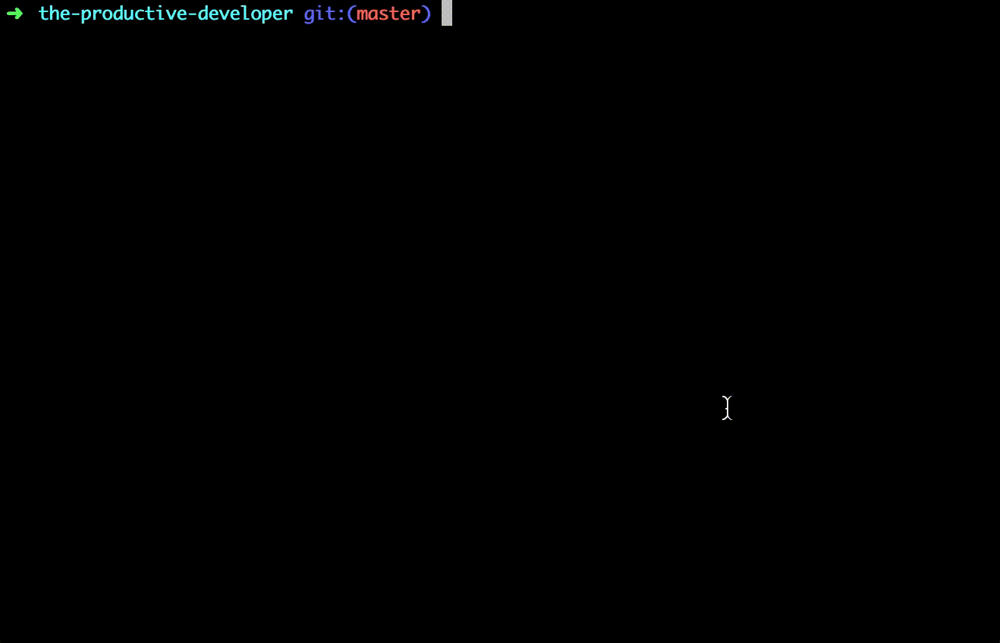
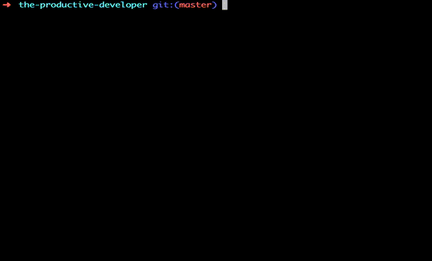

Recently I was working on a project where a team norm was to add the story number to all commits associated with it. 
For example:

```sh
git commit -m "Some change here [123456]"
```

The second part of the team norm was to include the story number in the name of the branch. For example:

```sh
git checkout-b bashteam/123456
```

I like to commit often and this seemed like a lot of work to me, especially when the story number is in the branch name! 
To be more of a productive developer, I added a function and a git alias to my bash profile. Don't worry, I'll explain!

# The end goal 
I wanted to be able to do this:



```sh
gc -m "this is a commit message [$task]"
```


`$task` will be replaced by the story number extracted from the name of the branch.

I also wanted to alias `git commit` to `gc` to save typing out 8 extra characters. 

# How can I achieve this?
## Edit your bash profile




Note - your file may not be called `.zshrc`

At the bottom of your bash profile, add the following:

```sh
function task {
        task=$(git branch | grep "* bashteam/[0-9].*" | grep -o "[0-9].*")
}

alias gc="task; git commit"
```

## What and where is my bash profile?
You will find your bash profile in your home directory, in a file with one of these names: `~/.bashrc` 
, `~/.bash_profile` or `~/.zshrc`. If you are using a file browser, you may need to enable hidden files to see these 
as files which have a name beginning with a `.` are hidden by default. 

If you still don't see it, create one called `.bashrc` if that doesn't work, you may need to do some googling. 

## Common Pitfalls
There are a couple of common pitfalls: 

### 1. Branch name format
You need to have a branch name that matches the format from the first pipe to grep, I.e. `"\* bashteam/[0-9]*"`. My team 
use a branch naming convention of `teamname/#123456`. 

### 2. Use double quotes

You need to write your commit message between double quotes or the string is interpreted literally as `[$task]`.

If you want to experiment with this before _committing_ to using this, you can run the task function to create the 
$task variable and echo it out.

```sh
git checkout -b bashteam/12345; 
task; 
echo "this is a task with story id [$task]";
this is a task with story id [12345]
```

## How does it work?
### The task function

```sh
function task {
        task=$(git branch | grep "* bashteam/[0-9].*" | grep -o "[0-9].*")
}
```

`task` is the name of the function we are running. When it runs, it creates a variable also called `task` which we 
can refer to using the dollar symbol as `$task`. 
The function says `$task` is equal to the result of the chain of commands inside the brackets after the dollar `()`

The chain of commands runs git branch, which prints out all of the branches that we have on our machine. The branch 
that we have checked out always has an asterisks at the start. Our branch name is:  
```sh
* bashteam/12345
```

We pipe (`|`) this list of branches to a command called grep and tell grep to look for a pattern that matches our 
branch. The pattern is known as a regular expression. The regular expression that grep is looking 
for (`"\* bashteam/[0-9]*"`) reads as follows a `*` followed by a ` ` followed by `bashteam/` any amount of numbers from 0 to 9. 

When it finds this, it sends that to another grep which looks for the first match of the numbers which is our story 
number.

We assign this story number to `$task`. 
### The alias 
```sh
alias gc="task; git commit"
```

This runs the task command each time you run `gc` then it runs the normal git commit command. This means that `$task` 
is always set when you are running it. 

You can use this as:
```sh
gc -m "commit message [$task]"
```
