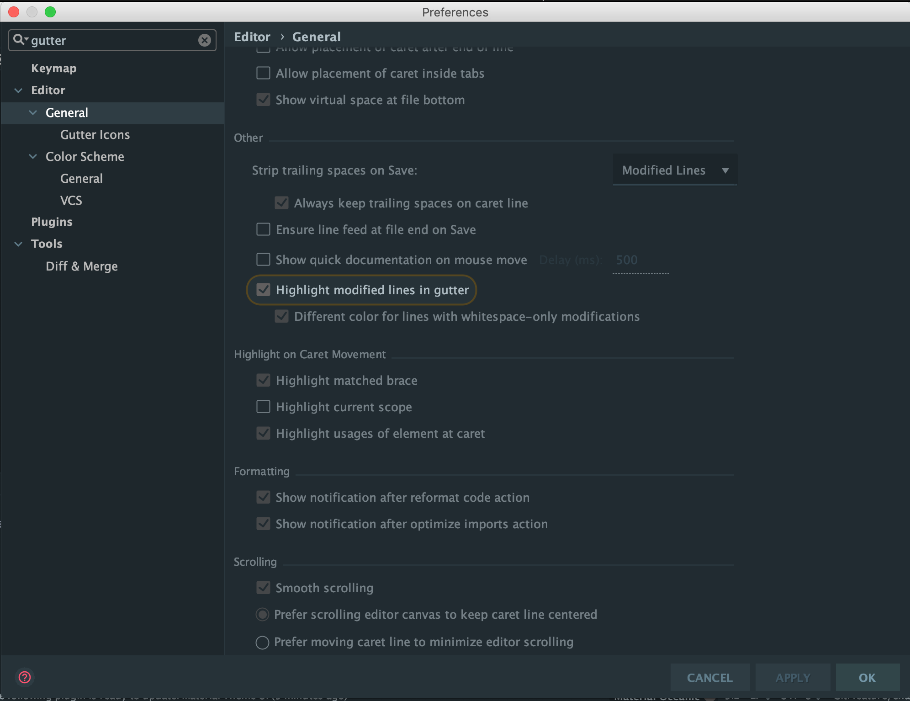

I am the first to admit that I can be a bit of a command-line show-off at times when it comes to working with git.

Maybe not a show-off – but I find when I am ready to do something, I like to summon my terminal with my trusty keyboard 
shortcut and in a few strokes, I have the job done.

Having said that, there are things that the terminal just does not do as well as my IDE.

# Show Lines Changed in the Gutter

Open a file that has already been committed in git and press enter a few times.

Down the left-hand side of the file, you will see a gutter beside the line numbers.

Notice that in this gutter beside the lines that have changed, a coloured marker is shown.

The reason for this is two-fold.

Firstly, to show you that you have indeed changed a line, and secondly so that you can click it to get some options!

**I use this to roll back the line or collection of lines to how they were at the last commit I.e before I changed them.**

This slideshow requires JavaScript.

> If you do not see this, open your settings and search for “gutter”. The setting to enable this is under Editor > 
General > Other > Highlight modified lines in the gutter.

# Annotate to speed up debugging

According to the Open-Closed principle of the SOLID principles, a class should have only one reason to change.

We can extend this definition to help with bug hunting.

_If some lines in a class have changed since the class was originally created, it is likely that those changes 
have introduced the bug._

This may not be the case, but when we have our <u>debugging detective hat</u> on, _every changed line is a suspect!_

When I am debugging, I open each of the classes related to the problem that I am trying to fix.

I right click on the left-hand side of the file on the line numbers and click “Annotate”.

This does an in-line `git blame` of the file.

This is not for the purpose of working out “whodunnit” but to see if the file changed recently, and why.

**The lines that changed from the most recent commit will have an asterisk beside them.**

If a file contains only asterisks chances are, the bug was not introduced in this file as it has never changed.

If a file has changed, you can mouse over the lines of the most recent commits and see why the lines changed.

The fact that the name of the person who made the change is also there is quite handy.

You can go and speak to them if you cannot work out what happened.

This slideshow requires JavaScript.

# Changing branch quickly

If you have not noticed this one before, do not worry because this one is in that corner where you do not spend a lot 
of time looking.

In the bottom right-hand corner of the screen, you will notice the name of the branch that you are on.

Click on the name of your branch to see a list of all branches listed.

Double click on the name of the branch you would like to change to.

This is particularly helpful if you cannot remember the name of the branch to type in for the `git checkout` command 
on the command line.

This slideshow requires JavaScript.

# Code reviews

I don’t know about you, but I spend a lot of my day reading and writing code in my IDE.

I know how everything should look and how it behaves when I make changes.

When I make a mistake, I see my red or yellow underlines.

In my setup, if a variable has been declared and not used it is coloured grey.

When reviewing code, the temptation is to just look at the diff of the code on GitHub, Bitbucket or whichever tool your 
team uses.

These tools do not give you the familiar syntax highlighting that you are used to looking at.

I prefer to checkout the branch that I am reviewing and annotate each of the files changed to see what changed.

_I find when I am looking at the changed file in my IDE, I have a sixth-sense that kicks in when I can see that the file 
does not look quite right even before I have started reading it._

I like to right click and show usages (I use the keyboard shortcut) to see if that class variable or protected method 
has been used or was added unnecessarily.

<u>Make your life easy in your review!</u>

Just as an aside to this section:

> If you find that the same code style issues / coding errors / unused code etc come up in code review repeatedly in 
your team, you should investigate using a linter or stricter compiler rules so that you do not have to check these 
things at all.

You should also agree as a team on what code style your team should use and what is expected in a code review.

These linters can be integrated with your IDE too, so you do not have to wait for them to build before you see the 
errors.

_Ideally, all you should have to do is check that the code makes sense._
